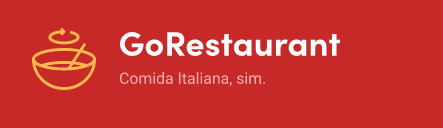
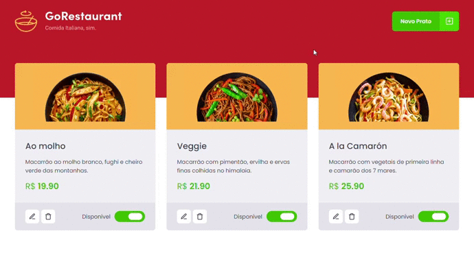

<h3 align="center">
  GoRestaurant - Front-end de sistama para restaurantes e lanchonetes
</h3>

## 🚀 Sobre

GoRestaurant é um dos desafios desenvolvidos durante o Bootcamp GoStack 11. O sistema permite a criação, atualização, remoção e listagem de pratos de comida oferecidos pelo restaurante.

## 💻 Principais Tecnologias Utilizadas

- React - (Lib JavaScript para criar interface de usuários em páginas web)
- TypeScript - (Adiciona tipagem e alguns outros recursos ao JS)
- Eslint - (Ferramenta de análise de código)
- Prettier - (Code Formatter)
- Styled Components - (Lib para CSS com Js)
- Axios - (Cliente HTTP)
- ...

## 🚀 Instalação e Execução

1. Faça um clone desse repositório;
2. Entre na pasta do projeto pelo terminal;
3. Rode `yarn` para instalar as dependências;
4. Rode `yarn start` para iniciar o servidor de desenvolvimento;
5. Rode `yarn json-server server.json -p 3333` para executar o servidor (fake api);
6. Acesse `localhost:3000` para ver no navegador;
